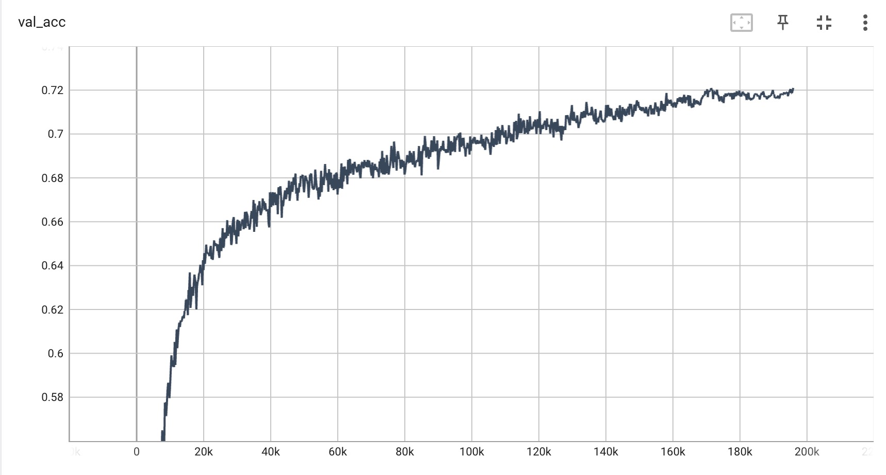

# ViT-CIFAR

Modified version of Repo https://github.com/omihub777/ViT-CIFAR

## 1. Quick Start

1. **Install packages**

```sh
conda create -n torch2 python=3.10
conda activate torch2
conda install pytorch torchvision torchaudio pytorch-cuda=11.7 -c pytorch -c nvidia
pip install pytorch_lightning==2.0.2 torch_summary tensorboard==2.13.0 warmup_scheduler
```

2. **Train ViT on CIFAR-100**

```sh
python main.py --autoaugment --label-smoothing --mixup --max-epoch 1000 --num-layers 7 --head 12 --hidden 384 --dropout 0.1 --dataset c100 --patch 8 --mlp-hidden 768 --warmup-epoch 10 --weight-decay 0.01 --seed 42 --batch-size 256 --gpu-id 0
```


* Validation Accuracy on CIFAR-100


## 2. Results

|Dataset|Acc.(%)|Time|
|:--:|:--:|:--:|
|CIFAR-100|**72.1**|4.099hr|

* Number of parameters: 8.4 M


## 3. Hyperparams

|Param|Value|
|:--|:--:|
|optimizer|AdamW|
|autoaugment| true|                                                                                 
|batch_size| 256|                                                                                   
|benchmark| true|                                                                                   
|beta1| 0.9 |                                                                                       
|beta2| 0.999 |                                                                                     
|criterion| ce |                                                                                    
|cutmix| false |                                                                                  
|dataset| c100  |                                                                                 
|dropout| 0.1 |                                                                                     
|dry_run| false |                                                                                   
|eval_batch_size| 1024 |                                                                 
|gpu_id| '0' |                                                                                 
|gpus| 1 |                                                                  
|head| 12 |                                                                                       
|hidden| 384 |                                                                                   
|in_c| 3 |                                                                                        
|is_cls_token| true |                                                                               
|label_smoothing| true |                                                                          
|lr| 0.001 |                                                                                    
|max_epochs| 1000 |                                                                              
|mean| [0.5071, 0.4867, 0.4408]|                                                                                         
|min_lr| 1.0e-05 |                                                                                  
|mixup| true |                                                                             
|mlp_hidden| 768 |                                                                             
|model_name| vit |                                                                                 
|num_classes| 100 |                                                                                 
|num_layers| 7 |                                                                                    
|num_workers| 32 |                                                                                 
|off_benchmark| false |                                                                            
|off_cls_token| false |                                                                             
|padding| 4 |                                                                                      
|patch| 8 |                                                                                      
|precision| bf16-mixed |                                                                            
|project_name| VisionTransformer |                                                                
|rcpaste| false |                                                                                 
|seed| 42 |                                                                                       
|size| 32 |                                                                                    
|smoothing| 0.1 |                                                                          
|std| [0.2675, 0.2565, 0.2761]|                                                                                         
|warmup_epoch| 10 |                                                                                 
|weight_decay| 0.01 |


## 4. Ref.
* Repo: https://github.com/omihub777/ViT-CIFAR